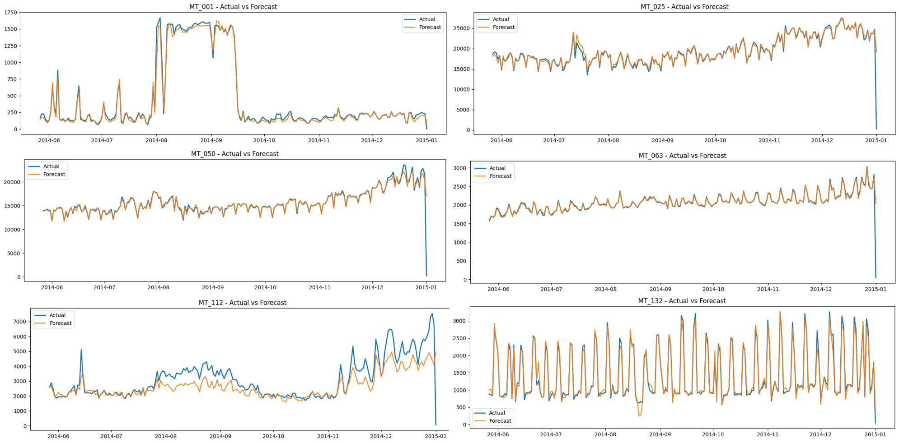
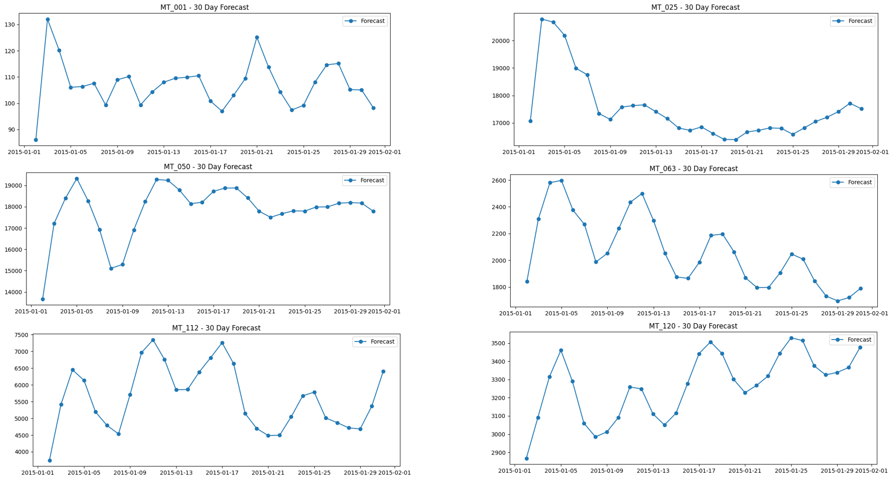
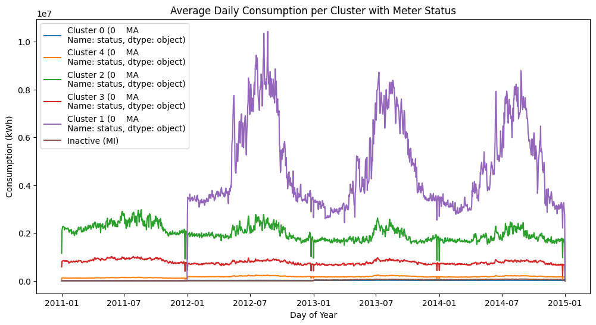
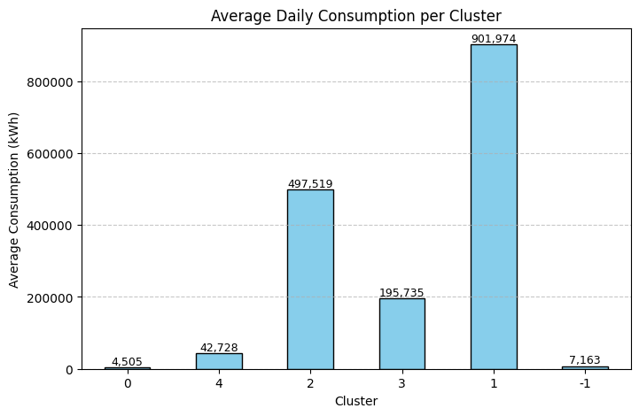

# Electricity Consumption Forecasting and Clustering

## 1. Introduction
This project analyzes smart meter readings originally recorded at 15-minute intervals (≈140,000 rows) and aggregated to daily values (≈1,462 rows). The goal is twofold:  
1. Forecast electricity consumption using machine learning models.  
2. Explore consumption patterns through clustering.  

The analysis highlights how meter activity levels (from mostly active to mostly inactive) influence both forecasting accuracy and cluster assignment.

---

## 2. Forecasting Analysis

### 2.1 Metrics Across Meters
Selected meters exhibit varying levels of activity and volatility, which significantly affect model performance:

| Meter | Zero Share | RMSE   | MAE   | MAPE   |
|-------|-----------|--------|-------|--------|
| MT_202 | 0–10%     | 736.6  | 258.0 | 32.96% |
| MT_180 | 0–10%     | 678.1  | 304.4 | 58.97% |
| MT_132 | 10–20%    | 117.3  | 77.6  | 9.92%  |
| MT_050 | 20–30%    | 1182.0 | 284.6 | 37.01% |
| MT_001 | 20–30%    | 55.4   | 31.9  | 29.90% |
| MT_025 | 20–30%    | 1347.2 | 401.1 | 31.77% |
| MT_063 | 20–30%    | 136.4  | 27.3  | 20.80% |
| MT_173 | 30–40%    | 312.7  | 79.5  | 68.59% |
| MT_092 | 50–60%    | 363.3  | 176.5 | 59.18% |
| MT_165 | 60–70%    | 577.2  | 354.1 | 83.33% |
| MT_112 | 70–80%    | 803.2  | 532.1 | 48.78% |
| MT_120 | 70–80%    | 501.4  | 325.0 | 32.05% |

Meters with higher percentages of zero readings and stronger volatility tend to produce larger errors.

---

### 2.2 Actual vs Forecast Examples
To illustrate model behavior across activity levels, six meters were selected, one from each cluster. These represent a range of activity patterns: from mostly active meters with steady daily demand to mostly inactive ones dominated by zero consumption.  

- Highly active meters show clear daily cycles with moderate forecast errors.  
- Mostly inactive meters yield higher MAPE, as small absolute errors inflate relative error percentages.  
- Volatile meters illustrate how sudden spikes or dips challenge the model.  

---

### 2.3 One-Day Forecasts
For the same meters, day-level forecasts are shown to highlight model sensitivity to fluctuations:  

These plots confirm that forecast accuracy correlates strongly with both activity level and volatility.

---

## 3. Clustering Analysis

### 3.1 Cluster Assignments
Clustering was used to categorize meters into activity groups:  

- **Mostly Active (MA):** 331 meters  
- **Mostly Inactive (MI):** 39 meters  

---

### 3.2 Average Daily Consumption by Cluster
The clusters differ not only in number of meters but also in average daily energy consumption:  

| Cluster | Average Daily Consumption |
|---------|---------------------------|
| 0   (mostly inactive)   | 4,505                     |
| 1       | 901,974                  |
| 2       | 497,519                   |
| 3       | 195,735                   |
| 4       | 42,728                    |
| -1 ( inactive) | 7,163                |

**Inactive meters use almost no electricity most days, but sharp spikes make their total consumption appear higher than the “mostly inactive” group.**
---

## 4. Conclusion
This analysis highlights:  
- The **impact of zeros and volatility** on forecasting accuracy.  
- The usefulness of **clustering** in distinguishing active vs. inactive meters.  
- The potential of machine learning models like LightGBM for practical demand forecasting, though with challenges on sparse or highly variable data.  

Future improvements could include integrating calendar effects (holidays, weekends) and advanced hyperparameter optimization to improve performance across all meter categories.

---

## 4. Discussion
- **Zero Days:** Forecast accuracy dropped sharply when meters had >50% zero readings.  
- **Volatility:** Even meters with few zeros (e.g., MT_202) showed errors if daily totals fluctuated strongly (100 and 300 KWH).  
- **Metrics:** MAPE inflated for low-consumption meters; RMSE/NRMSE were more stable indicators.  

---
## 5. Conclusion
Forecasting electricity usage depends as much on data behavior as on the model itself.

**Key insights:**

- High-consumption, stable meters forecast well (MAPE ≈ 10%).

- Sparse or volatile meters remain challenging (MAPE 50–80%).

- Model comparison: LightGBM generally outperformed Random Forest, especially after hyperparameter tuning, though both struggled with highly volatile meters.

- Data aggregation: Due to computational constraints, the model was trained on daily aggregated data rather than 15-minute intervals. This aggregation is an important factor affecting performance, particularly for meters with rapid fluctuations.

**Future work:**

- Try alternative metrics (SMAPE, weighted MAPE).

- Build two-stage models (classify zero vs non-zero days, then forecast).

- Add external features (holidays, weather). 

**Future work:**  
- Try alternative metrics (SMAPE, weighted MAPE).  
- Build two-stage models (classify zero vs non-zero days, then forecast).  
- Add external features (holidays, weather).  

